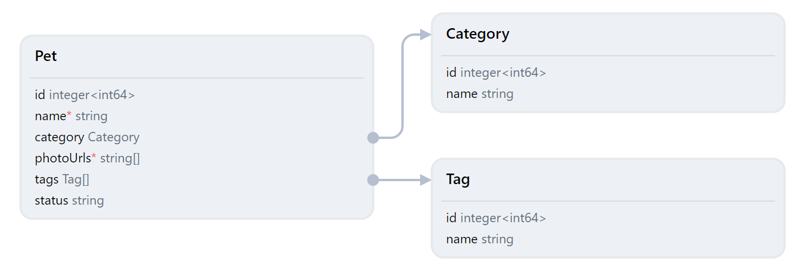

# qubership-apihub-class-view

A JavaScript library for interactive, customizable representation of entities and their relationships as UML class diagrams. It renders classes, properties, and relationships with rich customization capabilities and provides an API to customize interaction.



## Features

- **Auto-layout**: Automatic positioning of classes and relationships
- **Transitions Animation**: Smooth transitions when updating the diagram
- **Selection**: Select classes and relationships for interaction
- **Tooltip**: Contextual information on hover
- **Navigation**: Programmatically navigate to specific elements in the diagram
- **Zoom and Pan**: Control the viewable area of the diagram
- **TypeScript Support**: Full TypeScript definitions for better development experience

## Getting Started

Include `qubership-apihub-class-view` into your project using npm:

```bash
npm install @netcracker/qubership-apihub-class-view --save
```

Import the ClassView component in your source code:

```javascript
import { ClassViewComponent } from '@netcracker/qubership-apihub-class-view';
import '@netcracker/qubership-apihub-class-view/class-view.css';
```

Create and get Class View:

```javascript
const classView = new ClassViewComponent();
document.body.appendChild(classView);
```

or

```html
<class-view-component id="cv"></class-view-component>
```

```javascript
const classView = document.getElementById('cv');
```

## Working with API

Once Class View is initialized you can access its _properties_ (e.g. `classView.selectedObjects`), call _methods_ (e.g. `classView.navigateTo(objects)`) and subscribe to its _events_.

Class View component implements the standard [`EventTarget`](https://developer.mozilla.org/en-US/docs/Web/API/EventTarget) interface, thus the following methods can be used to register and remove event listeners:

- `addEventListener(type, callback)`
- `removeEventListener(type, callback)`

### Content

Content to render can be set using the `content` property:

```javascript
const content = {
  classes: [
    {
      key: 'Pet',
      name: 'Pet',
      properties: [
        {
          key: 'Pet[id]',
          kind: 'property',
          name: 'id',
          propertyType: 'integer<int64>'
        },
        {
          key: 'Pet[name]',
          kind: 'property',
          name: 'name',
          propertyType: 'string',
          required: true
        },
        {
          key: 'Pet[category]',
          kind: 'property',
          name: 'category',
          propertyType: 'Category'
        },
        {
          key: 'Pet[photoUrls]',
          kind: 'property',
          name: 'photoUrls',
          propertyType: 'string[]',
          required: true
        },
        {
          key: 'Pet[tags]',
          kind: 'property',
          name: 'tags',
          propertyType: 'Tag[]'
        },
        {
          key: 'Pet[status]',
          kind: 'property',
          name: 'status',
          propertyType: 'string'
        }
      ]
    },
    {
      key: 'Category',
      name: 'Category',
      properties: [
        {
          key: 'Category[id]',
          kind: 'property',
          name: 'id',
          propertyType: 'integer<int64>'
        },
        {
          key: 'Category[name]',
          kind: 'property',
          name: 'name',
          propertyType: 'string'
        }
      ]
    },
    {
      key: 'Tag',
      name: 'Tag',
      properties: [
        {
          key: 'Tag[id]',
          kind: 'property',
          name: 'id',
          propertyType: 'integer<int64>'
        },
        {
          key: 'Tag[name]',
          kind: 'property',
          name: 'name',
          propertyType: 'string'
        }
      ]
    }
  ],
  relations: [
    {
      key: 'Pet-Category',
      kind: 'property-to-class-reference',
      leafPropertyKey: 'Pet[category]',
      referenceClassKey: 'Category'
    },
    {
      key: 'Pet-Tags',
      kind: 'property-to-class-reference',
      leafPropertyKey: 'Pet[tags]',
      referenceClassKey: 'Tag'
    }
  ]
};

// Set content to class view
classView.content = content;
```

New data should be set to the `content` property each time your data has changed. Class View will update the diagram presentation accordingly.

### Events

Class View provides the following events:

| Event Name | Description |
|------------|-------------|
| `objects-select` | Selection changes |
| `layout-start` | Layout calculation begins |
| `layout-finish` | Layout calculation ends |
| `update-start` | Content update begins |
| `update-finish` | Content update completes |
| `zoom-change` | Zoom level changes |
| `viewport-center-change` | Viewport center changes |

Example:

```javascript
classView.addEventListener('objects-select', (event) => {
  console.log('Selection changed:', event.detail.newValue);
});
```

### Properties

| Property | Description |
|----------|-------------|
| `content` | Gets or sets the diagram content (classes and relationships) |
| `selectedObjects` | Array of currently selected objects |
| `zoom` | Current zoom level |
| `viewportCenter` | Center point of the viewport |
| `animationDuration` | Duration for animations in milliseconds |
| `classShapeFunction` | Function to determine the shape of classes (added in recent versions) |

### Methods

| Method | Description |
|--------|-------------|
| `navigateTo(objects, options)` | Navigate to specific objects in the diagram with optional configuration |
| `invalidate()` | Force redraw of the diagram |

## Data Model

### Classes

```typescript
interface ClassObject {
  key: string;          // Unique identifier
  name: string;         // Display name
  properties?: PropertyObject[]; // Class properties
  shape?: string;       // Optional shape configuration
  deprecated?: boolean; // Whether the class is deprecated
}
```

### Properties

```typescript
// Leaf property (simple property)
interface LeafPropertyObject {
  key: string;          // Unique identifier
  kind: 'property';     // Type discriminator
  name: string;         // Display name
  propertyType?: string; // Type of the property
  required?: boolean;   // Whether the property is required
  deprecated?: boolean; // Whether the property is deprecated
}

// Property group
interface PropertiesGroupObject {
  key: string;          // Unique identifier
  kind: 'group';        // Type discriminator
  name: string;         // Display name
  properties: PropertyObject[]; // Child properties
  deprecated?: boolean; // Whether the group is deprecated
}

// Union type for any property
type PropertyObject = LeafPropertyObject | PropertiesGroupObject;
```

### Relations

```typescript
// Property to class reference relation
interface PropertyToClassRelationObject {
  key: string;            // Unique identifier
  kind: 'property-to-class-reference'; // Type discriminator
  leafPropertyKey: string; // Source property key
  referenceClassKey: string; // Target class key
}

// Include properties group relation
interface IncludePropertiesGroupRelationObject {
  key: string;            // Unique identifier
  kind: 'include-properties-group'; // Type discriminator
  propertyGroupKey: string; // Source property group key
  includedClassKey: string; // Target class key
}

// Union type for any relation
type RelationObject = PropertyToClassRelationObject | IncludePropertiesGroupRelationObject;
```

## Advanced Usage

### Custom Navigation

You can programmatically navigate to specific objects using the `navigateTo` method:

```javascript
// Navigate to a specific class
classView.navigateTo([myClass], {
  insets: { top: 20, right: 20, bottom: 20, left: 20 }
});
```

The `insets` parameter (with `top`, `right`, `bottom`, and `left` properties in pixels) defines padding between the viewport edges and the content being navigated to. This ensures that objects are not positioned directly at the edge of the view but have some space around them.

### Handling Selection Changes

Listen for selection changes to perform custom actions:

```javascript
classView.addEventListener('objects-select', (event) => {
  const { newValue, oldValue } = event.detail;
  
  // Perform actions based on selection change
  if (newValue.length > 0) {
    showDetails(newValue[0]);
  } else {
    hideDetails();
  }
});
```

### Custom Class Shapes

You can customize class shapes by setting the `classShapeFunction`:

```javascript
classView.classShapeFunction = (classObject) => {
  // Return 'round-rectangle' for specific classes, default to 'rectangle'
  return classObject.isSpecial ? 'round-rectangle' : 'rectangle';
};
```

## Examples

Here are real-world examples demonstrating how to use the Class View component:

### Basic Example - Creating a Class Diagram

```javascript
// Define class and property objects
const PROPERTY = {
  key: 'property1',
  kind: 'property',
  name: 'Property',
  propertyType: 'string'
};

const GROUP_PROPERTY = {
  key: 'groupProperty',
  kind: 'property',
  name: 'Group Property',
  propertyType: 'number'
};

const GROUP = {
  key: 'group1',
  kind: 'group',
  name: 'Properties Group',
  properties: [GROUP_PROPERTY]
};

const CLASS = {
  key: 'class1',
  name: 'MyClass',
  properties: [PROPERTY, GROUP]
};

// Define content with classes and relationships
const content = {
  classes: [CLASS],
  relations: []
};

// Create and initialize the class view
const classView = new ClassViewComponent();
classView.content = content;
document.body.appendChild(classView);
```

### Dynamic Content Updates

```javascript
// Initial class definition
const CLASS_ONE = {
  key: 'class1',
  name: 'Class 1',
  properties: [
    {
      key: 'property1',
      kind: 'property',
      name: 'property1',
      propertyType: 'number',
    }
  ]
};

// Updated class definition
const CLASS_TWO = {
  key: 'class2',
  name: 'Class 2',
  properties: [
    {
      key: 'property1',
      kind: 'property',
      name: 'property1',
      propertyType: 'number',
    }
  ]
};

// Toggle between different class views
function toggleClass(showClassOne) {
  classView.content = {
    classes: [showClassOne ? CLASS_ONE : CLASS_TWO]
  };
}

// Switch class view every 3 seconds
let showClassOne = true;
setInterval(() => {
  showClassOne = !showClassOne;
  toggleClass(showClassOne);
}, 3000);
```

### Extended Example with Relationships

```javascript
// Create class objects
const classA = {
  key: 'classA',
  name: 'Class A',
  properties: [
    {
      key: 'propA1',
      kind: 'property',
      name: 'propA1',
      propertyType: 'string'
    },
    {
      key: 'propA2',
      kind: 'property',
      name: 'propA2',
      propertyType: 'ClassB'
    }
  ]
};

const classB = {
  key: 'classB',
  name: 'Class B',
  properties: [
    {
      key: 'propB1',
      kind: 'property',
      name: 'propB1',
      propertyType: 'number'
    }
  ]
};

// Create relationship between Class A's property and Class B
const relationship = {
  key: 'rel-A-B',
  kind: 'property-to-class-reference',
  leafPropertyKey: 'propA2',
  referenceClassKey: 'classB'
};

// Set the content with classes and relationship
classView.content = {
  classes: [classA, classB],
  relations: [relationship]
};

// Navigate to all objects
classView.navigateTo([classA, classB]);
```

### React Integration

Here's how to integrate Class View within a React component:

```jsx
import React, { useRef, useEffect, useState } from 'react';
import { ClassViewComponent, EVENT_SELECTION_CHANGE } from '@netcracker/qubership-apihub-class-view';
import '@netcracker/qubership-apihub-class-view/class-view.css';

// Custom hook for handling event subscriptions
function useMemoSubscription(view, eventType, handler, transformer) {
  const listenerRef = useRef(null);
  
  useEffect(() => {
    if (!view) return;
    
    const listener = (event) => {
      const value = transformer(event);
      handler(value);
    };
    
    if (listenerRef.current) {
      view.removeEventListener(eventType, listenerRef.current);
    }
    
    listenerRef.current = listener;
    view.addEventListener(eventType, listener);
    
    return () => {
      if (listenerRef.current) {
        view.removeEventListener(eventType, listenerRef.current);
      }
    };
  }, [view, eventType, handler, transformer]);
}

function ClassDiagram({ data, onSelectionChange }) {
  const viewContainerRef = useRef(null);
  const [view, setView] = useState(null);
  
  // Create class view component
  useEffect(() => {
    if (!viewContainerRef.current) return;
    
    const component = new ClassViewComponent();
    component.style.position = 'absolute';
    component.style.top = '0';
    component.style.left = '0';
    component.style.right = '0';
    component.style.bottom = '0';
    component.style.fontFamily = 'Inter, sans-serif';
    
    // Custom shape function
    component.classShapeFunction = (object) => {
      return object.isSpecial ? 'round-rectangle' : 'rectangle';
    };
    
    viewContainerRef.current.appendChild(component);
    setView(component);
    
    return () => {
      if (viewContainerRef.current && component.parentNode === viewContainerRef.current) {
        viewContainerRef.current.removeChild(component);
      }
    };
  }, []);
  
  // Subscribe to selection changes
  useMemoSubscription(
    view,
    EVENT_SELECTION_CHANGE,
    onSelectionChange,
    (event) => event.detail.newValue[0]
  );
  
  // Update content when data changes
  useEffect(() => {
    if (view && data) {
      view.content = data;
    }
  }, [view, data]);
  
  return <div ref={viewContainerRef} style={{ width: '100%', height: '500px' }} />;
}

export default ClassDiagram;
```

For more examples, check out the [Storybook](https://netcracker.github.io/qubership-apihub-class-view/main/).

## Available Scripts

The project provides several npm scripts for development, building, and testing:

| Script | Description |
|--------|-------------|
| `build` | Builds both the distributable library and the showcase |
| `build:dist` | Builds the distributable library for publishing |
| `build:showcase` | Builds the Storybook showcase for demonstration |
| `development:local-server` | Starts a local Storybook development server on port 6006 |

## Contributing

Please read [CONTRIBUTING.md](CONTRIBUTING.md) for details on our code of conduct and the process for submitting pull requests to us.
